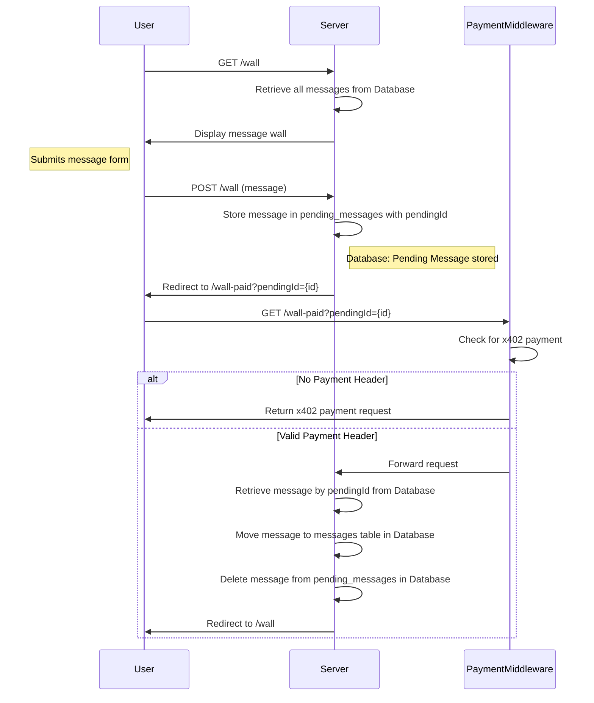

# x402 public wall

This project shows how to use the [https://x402.org](x402) express middleware to implement a form and pay for submissions.

### Features:
* no client side javascript
* configurable through environment variables
* basic sanitization in posts
* rudimentary moderation through admin password

Sequence diagram of what goes on:

The key takeaway is that the form post request stores a temporary message that then gets used by the flow with the payment.
The advantage is that no client side javascript is needed, the middleware deals with the x402 paywall, the rest is just a query string for the pending message.